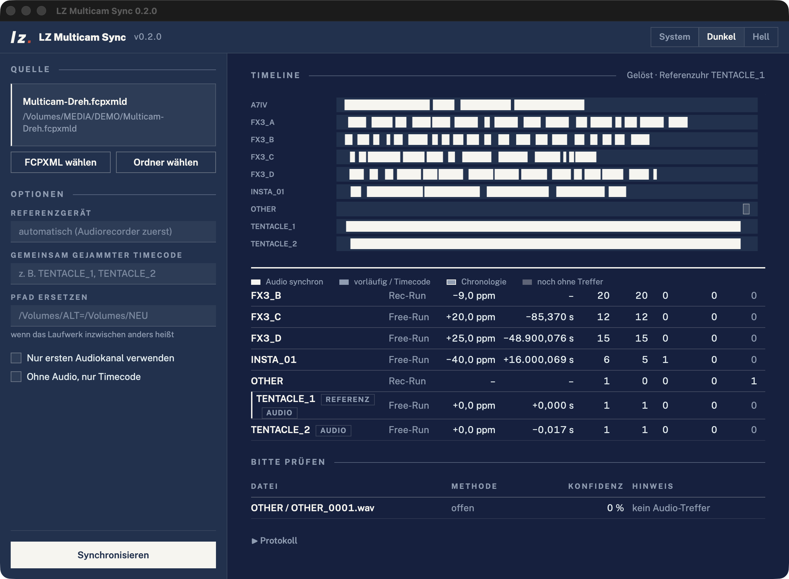
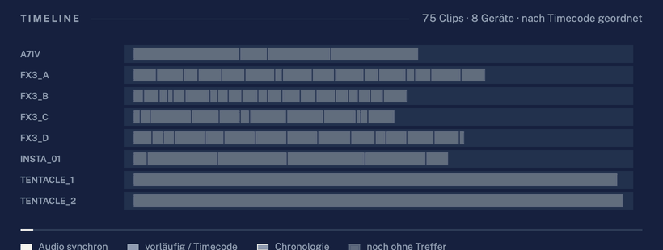

<p align="center">
  <picture>
    <source media="(prefers-color-scheme: dark)" srcset="docs/brand/lzm_hauptlogo_offwhite.svg" />
    
  </picture>
</p>

<h1 align="center">LZ Multicam Sync</h1>

<p align="center">
  <b>Multicam and audio sync for post-production on macOS and Windows.</b><br />
  Drop in a shoot day, get every camera and recorder on one timeline – with a reason for every clip.
</p>

<p align="center">
  <a href="https://github.com/larszu/lz-multicam-sync/releases/latest">
    
  </a>
</p>

<p align="center">
  <picture>
    <source media="(prefers-color-scheme: light)" srcset="docs/screenshots/app-light.png" />
    
  </picture>
</p>

---

## Why LZ Multicam Sync

- **One clock model per device.** Every camera and recorder gets an offset *and*
  a drift in ppm. A camera that runs 25 ppm fast is 0.2 s off after two hours –
  a single offset per clip cannot fix that, a clock model can.
- **Solved together, not clip by clip.** Every audio match becomes an equation;
  all of them are solved at once with robust least squares. A wrong match shows
  up as an outlier and drops out instead of dragging the timeline.
- **Timecode understood.** Rec-run and free-run are detected per camera, a
  timecode that rolls over midnight is unwrapped, jammed recorders are checked
  against each other (17 ms off is reported, not hidden).
- **Short clips found.** One-second takes that other tools leave as *not synced*
  are searched inside the narrow window their neighbouring files allow, and
  confirmed against a second device.
- **Watch it sort.** The timeline shows the real clips while the engine works:
  input order, timecode islands, every audio match pulling clips into place,
  then the solved result.
- **Sub-frame audio.** Audio-only clips keep their exact position through the
  in-point (1/48000 s); video snaps to the nearest frame.
- **Honest output.** Per clip: method, confidence, measurement points, residual.
  Per device: timecode mode, drift, timecode offset to the reference. Material
  from outside the shoot stays out of the timeline.
- **FCPXML in, FCPXML out.** Works with DaVinci Resolve and Final Cut Pro:
  `.fcpxml`, `.fcpxmld` bundles (also zipped) or a plain media folder.

<p align="center">
  
</p>

## How it compares

What Syncaila 3 did with the same shoot (90 files, 11 devices) and what LZ Multicam Sync does differently. Details: [docs/syncaila-analyse.md](docs/syncaila-analyse.md).

| | **LZ Multicam Sync** | Syncaila 3 (observed) |
| --- | --- | --- |
| Time model | **Offset + drift per device, solved globally** | offset per clip |
| Rec-run / free-run timecode | **Detected per camera** | used |
| Timecode over midnight | **Unwrapped** | – |
| Clips under ~5 s | **Searched in the neighbour window, cross-checked** | left as *Not synced* |
| Clip recorded hours before the shoot | **Kept out, with a note** | placed at timeline start |
| Groups without a link to the rest | **Kept in sync among themselves** | – |
| Explanation per clip | **Method, confidence, residual** | match quality |
| Live view while syncing | **Real clips moving into place** | progress bar |
| Price | **Free, MIT** | commercial |

## Accuracy

- **Project-sized synthetic shoot** (`benchmarks/scale.py`: 2 h, 9 devices, 76
  files, rec-run, drift −40…+25 ppm, midnight rollover, short clips): 75/76
  placed – the missing one is deliberately unrelated audio –, largest error
  0.17 ms, every drift within 0.1 ppm, 2:40 min on an Apple-Silicon Mac.
- **Real shoot, metadata only** (anonymised fixture in `tests/fixtures`):
  timecode mode of every camera detected, layout inside each free-run camera
  matches Syncaila within 0.25 s – the rest is clock drift that only the audio
  pass measures.
- Open: audio run against the real material of that shoot.

## Download & first start

[Releases](https://github.com/larszu/lz-multicam-sync/releases/latest):

| | |
| --- | --- |
| **Windows** `.exe` | ffmpeg included. Unsigned: *More info → Run anyway*. |
| **macOS** `.dmg` (Apple Silicon) | needs ffmpeg: `brew install ffmpeg`. Unsigned: right-click → *Open* the first time. |

Pick an FCPXML or a media folder (or drop it on the window), press
**Synchronisieren**; the result is written next to it as `… - lzsync.fcpxml`
and imports into Resolve or Final Cut Pro. Started with arguments, the same
file is the command-line tool.

## Command line

```bash
lzsync analyze "Shoot.fcpxml" --json sync.json        # FCPXML / .fcpxmld
lzsync analyze /Volumes/DRIVE/01_FOOTAGE              # or a media folder
lzsync compare "Shoot - lzsync.fcpxml" "Shoot - Syncaila.fcpxml"
```

| Option | Effect |
| --- | --- |
| `--remap OLD=NEW` | replace a path prefix when the drive is named differently |
| `--reference DEVICE` | reference clock (default: the audio recorder with the most recording time) |
| `--jammed A,B,C` | devices sharing jammed timecode – linked even without audio |
| `--channels first` | first channel only instead of a mix (phase cancellation) |
| `--no-audio` | timecode and metadata only |
| `--split-gap S` | pause in seconds after which a free-run camera starts a new island |

## How it works

1. **Islands.** Clips whose relative timing is known form an island: all clips of a
   free-run camera, or each file of a rec-run camera on its own.
2. **Coarse match.** Log-energy envelope at 100 Hz with the trend removed;
   masked normalised cross-correlation between islands of different devices –
   gaps between clips do not count.
3. **Fine match.** GCC-PHAT on the raw audio at up to 40 places of each overlap,
   sub-sample peak, robust line fit.
4. **Global solve.** `global = offset + t · (1 + ppm)` per device; audio matches
   plus weak hints from timecode, wall-clock time and `--jammed`; Huber IRLS.
5. **Checks.** A camera cannot record two files at once; short-clip window
   search; out-of-session material.
6. **Output.** FCPXML 1.10, one lane per device (video above, recorders below),
   roles and notes for chronology, sub-groups and unplaced clips.

Background and sources: [docs/forschung.md](docs/forschung.md).

## Build from source

Requires Python 3.10+ and ffmpeg.

```bash
python3.12 -m venv .venv && .venv/bin/pip install -e '.[dev]'
.venv/bin/pytest                 # tests
.venv/bin/lzsync-gui             # window
sh packaging/build_mac.sh        # app + DMG into dist/
```

The window is HTML/CSS in the system web view (pywebview), designed to the
Lars Zumpe Medienproduktion web guidelines; open `lzsync/ui/index.html?demo=sim`
in a browser to see the live timeline without Python. A `v*` tag builds the
Windows EXE and macOS DMG with GitHub Actions and attaches them to the release.

Built with Python, NumPy, SciPy, pywebview and ffmpeg.

## Author & support

Built and maintained by **Lars Zumpe** — Lars Zumpe Medienproduktion.
If it saves you an evening of lining up clips: [PayPal](https://paypal.me/larszumpe).
Donations are optional; the app stays free.

## License

MIT – see [LICENSE](LICENSE). Bundled: Public Sans (SIL OFL 1.1,
`lzsync/ui/assets/OFL-public-sans.txt`); the Windows EXE contains ffmpeg (GPL,
[gyan.dev builds](https://www.gyan.dev/ffmpeg/builds/)). The Lars Zumpe
Medienproduktion logo and signet are not covered by the MIT license.
